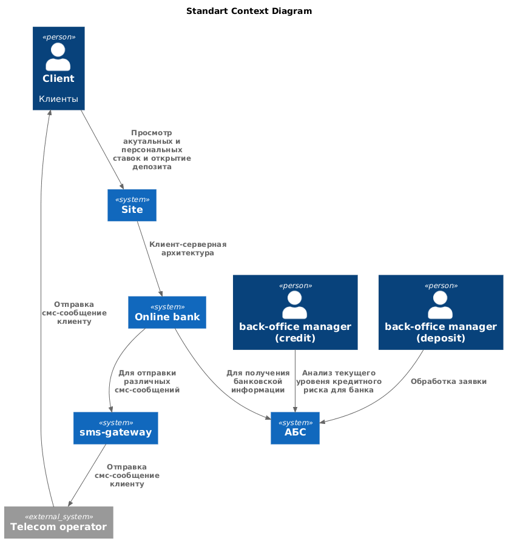
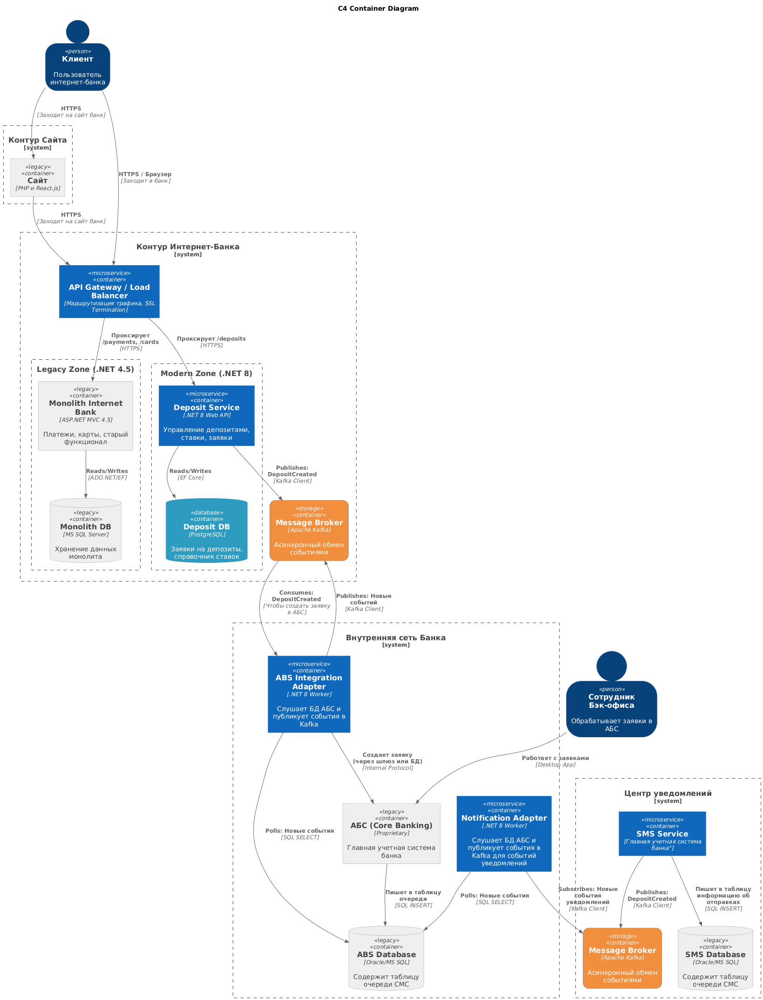

### **Название задачи:** Открытие депозитов онлайн
### **Автор:** Архитектор системы
### **Дата:** 25.12.25

### **Система как есть**
| **№** | **Действующие лица или системы**                                                                                           | **Use Case**                    | **Описание**                                                                                                                                                                                                                                                                                                          |
| :---: | :------------------------------------------------------------------------------------------------------------------------- | :------------------------------ | :-------------------------------------------------------------------------------------------------------------------------------------------------------------------------------------------------------------------------------------------------------------------------------------------------------------------- |
|  UC1  | Действующие лица: Клиент, сотрудник call-center, сотрудник бэк-офиса  Системы: система call-center, АБС, sms-gateway | Удаленное согласование депозита | 1. Клиент звонит в call-center для уточнения деталей депозита 2. Сотрудник call-center делает заявку в АБС 3. Сотрудник из бэк-офиса обрабатывает заявку и в АБС ставит ставку 4. АБС отправяет sms-уведомление клиенту об одобрении депозита                                                                |
|  UC2  | Действующие лица: Клиент, сотрудник фронт-офиса, сотрудник бэк-офиса  Системы: почтовая система                      | Согласование депозита в офисе   | 1. Клиент приходит в отделение для открытия депозита 2. Сотрудник фронт-офиса пишет письмо бэк-офису 3. Ответным письмом пишет ставку                                                                                                                                                                           |
|  UC3  | Действующие лица: сотрудник кредитования, сотрудник бэк-офиса  Системы: почтовая система, АБС                        | Согласование специальной ставки | 1. Cотрудники бэк-офиса обращаются в отдел кредитования 2. Сотрудник кредитования анализирует текущий уровень кредитного риска для банка в своём разделе АБС относительно этого клиента 3. Передаёт данные в письме 4. Эти данные менеджер депозитов добавляет в Excel-файл и вычисляет на их основе ставку. |
|  UC4  | Действующие лица: Клиент,сотрудник фронт-офиса  Системы: АБС                                                         | Открытие депозитов              | 1. Сотрудник Фронт-офиса озвучивает ставку 2. Клиент соглашается 3. Сотрудник фронт-офиса вносит всю информацию в АБС                                                                                                                                                                                           |

### **Функциональные требования**
Опишите здесь верхнеуровневые Use Cases. Их нужно оформить в виде таблицы с пошаговым описанием:

| **№** | **Действующие лица или системы**                                                                               | **Use Case**                          | **Описание**                                                                                                                                                                                                                                                                                                                                                       |
| :---: | :------------------------------------------------------------------------------------------------------------- | :------------------------------------ | :----------------------------------------------------------------------------------------------------------------------------------------------------------------------------------------------------------------------------------------------------------------------------------------------------------------------------------------------------------------- |
|  UC1  | Действующие лица: Клиент  Системы: sms-gateway                                                           | Открытие депозита для клиента         | 1. В интернет-банке клиент видит список доступных депозитов с актуальными ставками и персонализированные ставки лично для него. 2. Клиент указывает счёт и сумму депозита для открытия 3. Заявку обратывает сотрудник бэк-офиса в АБС 4. Приходит sms-уведомления после подтверждения размера ставки и открытия депозита 5. Приходит sms-подтверждение |
|  UC2  | Действующие лица: Клиент, сотрудник call-center, сотрудник фронт-офиса  Системы: система для call-center | Открытие депозита для нового клиент   | 1. В интернет-банке клиент видит список доступных депозитов с актуальными ставками  2. Клиент указывает свой номер телефона и Ф. И. О. 3. Менеджер call-center изучает заявку в системе кол-центра 4. Менеджер call-center звонит клиенту и предлагает особые условия 5. Клиент идет в отделение для идентификации                                     |
|  UC3  |                                                                                                                | Обработка заявки на открытие депозита | 1. Заявка попадает в АБС 2. Ее обрабатывает сотрудник бэк-офиса 2. Cотрудник бэк-офиса обращаются в отдел кредитования для согласования специальной ставки 3. Сотрудник кредитования анализирует текущий уровень кредитного риска для банка в своём разделе АБС относительно этого клиента 4. Обновляет информацию в АБС для вычисления ставки         |

### **Нефункциональные требования**
Опишите здесь нефункциональные требования и архитектурно значимые требования.

| **№** | **Требование**                                                                                                                                                                                                                                                                                          |
| :---: | :------------------------------------------------------------------------------------------------------------------------------------------------------------------------------------------------------------------------------------------------------------------------------------------------------ |
|   1   | Шифрование данных при передаче                                                                                                                                                                                                                                                                          |
|   2   | Отказаться от функционала СМС ядра и написать собственными силами                                                                                                                                                                                                                                       |
|   3   | Избежать прямой работы интернет-банка с API АБС в новом процессе                                                                                                                                                                                                                                        |
|   4   | При доработках во всех системах нужно как можно больше использовать технологии, которые уже есть в банке или которые совместимы с  существующими платформами разработки                                                                                                                                 |
|   5   | Предусмотреть равномерное горизонтальное масштабирование и распределение запросов между серверами, приложениями и ЦОД с учетом, что АБС может масштабироваться только вертикально из-за своей базы данных.                                                                                              |
|   6   | Если нужны очереди сообщений, то лучше использовать Kafka на перспективу. Правда, стоит учитывать, что текущая версия платформы интернет-банка несовместима с ней. Возможно, стоит подумать о переводе интернет-банка на микросервисную архитектуру, но пока только в рамках задачи открытия депозитов. |
### **Решение**

Диаграмма контекста в модели C4:

Обоснование связей:
- Сайт - это фронтенд или статика, которая хостится в интернете. Получает всю информацию у серверной части онлайн-банка через API для отображения для клиентов;
- Серверная часть онлайн-банка обращается к АБС для получения банковской информации или для отправки запроса на банковскую операцию. Так как требование №3 говорит о том, чтобы онлайн-банк не обращался напрямую к API АБС, то у них будет асинхронное взаимодействие через Kafka (в схеме Kafka нет, так как она относится к системе online-bank)
- Также sms-center вынесен в отдельную систему, согласно требованию №2. Также АБС и sms-center будут общаться через Kafka (в схеме Kafka нет, так как она относится к системе sms-center)

Теперь рассмотрим контейнерную диаграмму для cистем:

Целевая архитектура (High-Level Design):
- Система интернет-банка:
	- Старый монолит не трогаем:
		- это позволяет нам не сломать работающий функционал
	- Reverse Proxy / API Gateway:
		- Единая точка входа для API.
	    - Маршрутизация запросов в старый монолит и в новый микросервис
	    - На его уровне реализуется сквозное шифрование (нефункциональное требование №1)
	- Микросервис Deposit Service:
	    - **Стек:** .NET 8 (LTS). Это позволяет использовать современные библиотеки для Kafka, EF Core и контейнеризацию
	    - **База данных:** Отдельная БД (PostgreSQL или MS SQL), независимая от монолита и АБС
	- Шина данных (Apache Kafka):
	    - Обеспечивает асинхронность (Требование №6).
- Система АБС:
	- Старый монолит не трогаем:
		- это позволяет нам не сломать работающий функционал
		- есть люди, которые могут вносить изменения
	- ABS Integration Adapter
		- позволяет вычитывать из конкретной таблицы события для интернет-банка и передавать в Kafka
- Система SMS-уведомлений
	- Шина данных (Apache Kafka):
		- Обеспечивает асинхронность (Требование №6)
	- SMS Service:
		- Реализует отправку sms-сообщений

### **Альтернативы**

#### **Альтернатива 1**: Использовать notification service как часть онлайн-банка

Отказались, так как сервис уведомлений не должен зависеть от онлайн-банка и должен быть доступен даже если онлайн-банк не будет работать

### **Недостатки предложенного решения**

- Сложность отладки, так как количество микросервисов увеличилось
- Эксплуатационные расходы: необходимо поддерживать не только монолит, но и новые сервисы
- Проблема согласованности данных: информация о депозитах живет и в АБС, и в онлайн-банке