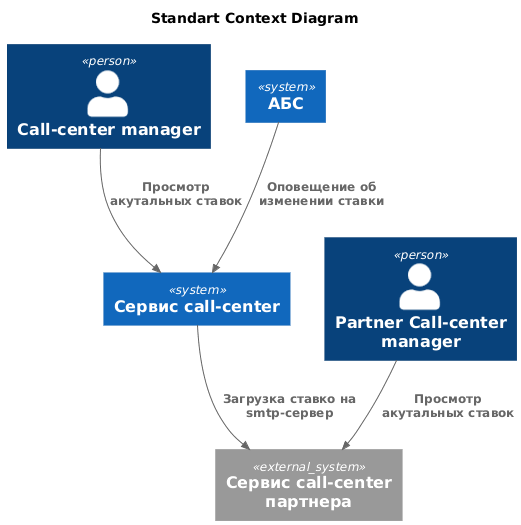
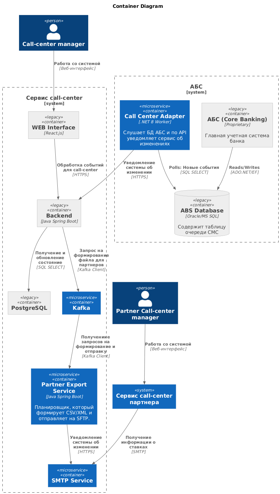

### **Название задачи:** Передача ставок в кол-центр
### **Автор:** Архитектор системы
### **Дата:** 25.12.25

### **Функциональные требования**
Опишите здесь верхнеуровневые Use Cases. Их нужно оформить в виде таблицы с пошаговым описанием:

| **№** | **Действующие лица или системы**                                                         | **Use Case**                                                                    | **Описание**                                                                                                                                                                                                                                                                                                                   |
| :---: | :--------------------------------------------------------------------------------------- | :------------------------------------------------------------------------------ | :----------------------------------------------------------------------------------------------------------------------------------------------------------------------------------------------------------------------------------------------------------------------------------------------------------------------------- |
|  UC1  | Действующие лица: Клиент, сотрудник call-center  Системы: система call-center, АБС | Сотрудники call-center консультируют клиентов по дебетовым ставкам              | 1. Клиент обращается к call-center, чтобы уточнить условия открытия депозита 2. Сотрудник call-center обращается к сервису call-center, чтобы узнать актуальные условия 3. Сервис call-center обращается в АБС, чтобы получить актуальные условия                                                                        |
|  UC2  | Действующие лица: Клиент, сотрудник call-center  Системы: система call-center, АБС | Сотрудники партнерского call-center консультируют клиентов по дебетовым ставкам | 1. В интернет-банке клиент видит список доступных депозитов с актуальными ставками  2. Клиент указывает свой номер телефона и Ф. И. О. 3. Менеджер call-center изучает заявку в системе кол-центра 4. Менеджер call-center звонит клиенту и предлагает особые условия 5. Клиент идет в отделение для идентификации |

### **Нефункциональные требования**
Опишите здесь нефункциональные требования и архитектурно значимые требования.

| **№** | **Требование**                                                                                                                                                                                                                                                                                          |
| :---: | :------------------------------------------------------------------------------------------------------------------------------------------------------------------------------------------------------------------------------------------------------------------------------------------------------ |
|   1   | Наладить процесс передачи информации об актуальных ставках между банком и кол-центром                                                                                                                                                                                                                   |
|   2   | Наладить процесс передачи информации об актуальных ставках между банком и партнёрским кол-центром. Они готовы получать актуальные ставки в виде файлов. Нет возможности сделать API-вызовы (например, через SFTP-протокол)                                                                              |

### **Решение**

Диаграмма контекста в модели C4:

Теперь рассмотрим контейнерную диаграмму для cистем (изображены только те элементы, которые участвуют в передаче ставок в колл-центры):

Целевая архитектура (High-Level Design):
- Система АБС:
	- Старый монолит не трогаем:
		- это позволяет нам не сломать работающий функционал
		- есть люди, которые могут вносить изменения, добавляем таблицу-нотификаций
	- Call Center Adapter (реализации требования №1)
		- позволяет вычитывать из конкретной таблицы события для колл-центра и уведомлять сервис колл-центра об изменениях
		- такой подход не будет нагружать АБС постоянными запросами от колл-центра, а у колл-центра всегда будет актуальная информация
- Сервис call-center:
	- Web:
		- добавлен интерфейс с выводом актуальной ставки
	- Бэкенд с базой данной:
		- добавлена ручка для изменения ставки. когда она вызывается, сервис обновляет значение ставки в своей базе (реализации требования №1)
		- добавлена ручка, которая отдает значение ставки; необходимо для web
	- Шина данных (Apache Kafka):
		- Для реализации паттерна Pub/sub
		- Бекенду необязательно дожидаться результата отправки ставки партнерам, можно делать асинхронно
	- Partner Export Server (реализации требования №2):
		- формирует файл и отправляет его на SFTP-сервер

### **Альтернативы**

#### **Альтернатива 1**: В колл-центре добавить сервис получения ставок

**Решение:** Раз в сутки (или раз в час) ходит в АБС, забирает актуальные ставки и сохраняет их в свою базу PostgreSQL. Это снизит нагрузку на АБС

**Проблема:** Может оказаться так, что у call-center неактуальная информация

#### **Альтернатива 2**:  
### **Недостатки предложенного решения**

- Сложность отладки, так как количество микросервисов увеличилось
- Эксплуатационные расходы: необходимо поддерживать не только монолит, но и новые сервисы
- Проблема согласованности данных: информация о депозитах живет и в АБС, и в онлайн-банке