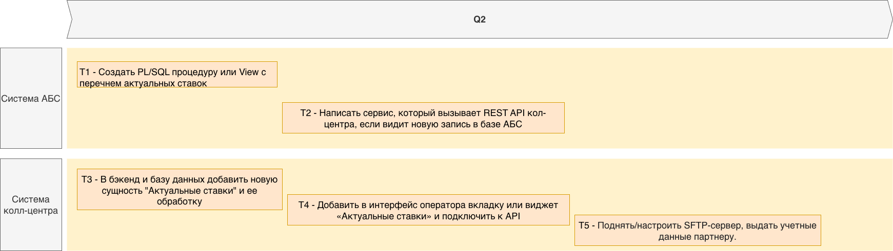

# Список задач

## Задачи для системы АБС:
1. Создать PL/SQL процедуру или View с перечнем актуальных ставок
2. Написать сервис, который вызывает REST API кол-центра, если видит новую запись в базе АБС

## Задачи для системы колл-центра:

3. В бэкенд и базу данных добавить новую сущность "Актуальные ставки" и ее обработку (добавить схему в базу, rest api для взаимодействия)
4. Добавить в интерфейс оператора вкладку или виджет «Актуальные ставки» и подключить к API
5. Развернуть (или использовать существующий) SFTP-сервер

# Roadmap

