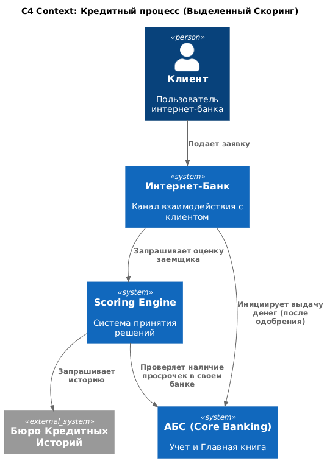
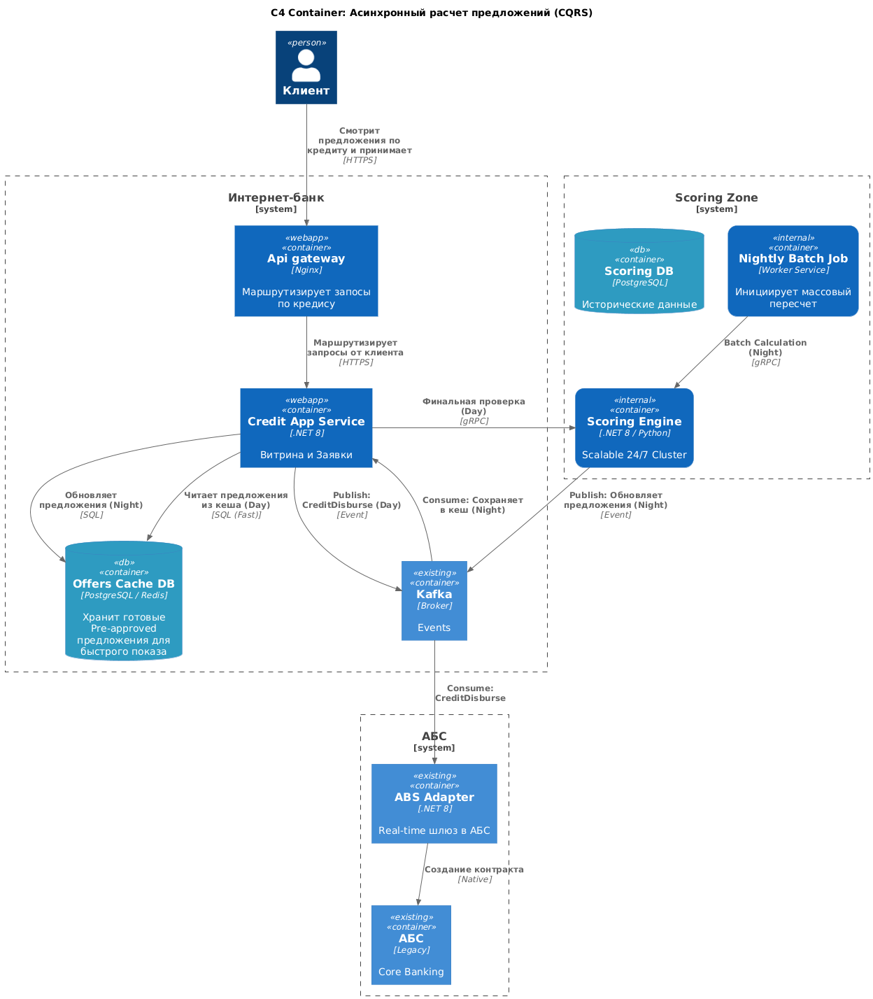

### **Название задачи:** Заявка на кредит онлайн
### **Автор:** Архитектор системы
### **Дата:** 25.12.25

### **Функциональные требования**
Опишите здесь верхнеуровневые Use Cases. Их нужно оформить в виде таблицы с пошаговым описанием:

| **№** | **Действующие лица или системы**                                                                         | **Use Case**                                 | **Описание**                                                                                                                                                                                                                                                                                                                                           |
| :---: | :------------------------------------------------------------------------------------------------------- | :------------------------------------------- | :----------------------------------------------------------------------------------------------------------------------------------------------------------------------------------------------------------------------------------------------------------------------------------------------------------------------------------------------------- |
|  UC1  | Действующие лица: Клиент, менеджер фронт-офиса  Системы: Кредитный конвейер, система скоринга, АБС | Подача заявки и скоринг нового клиента       | 1. Клиент подают заявку на кредит, оставив номер телефона и Ф. И. О. 2. Если клиент ещё заполнит паспортные данные, то одобрение/не одобрение кредита получает из системы скоринга 3. Получает СМС-уведомление, что нужно прийти в отделение 4. Клиент идет в отделение 5. Сотрудник фронт-офиса подает заявку на кредит через АБС   |
|  UC2  | Действующие лица: Клиент  Системы: АБС, SMS Service                                                | Подача заявки и скоринг действующего клиента | 1. По клиенту произошел скоринг 2. Клиент на сайте видит список доступных кредитов с актуальными условиями и предодобренное предложение по кредиту 3. Клиент подают заявку на кредит, указав счёт зачисления средств и данные для подачи заявки 4. Клиенту приходит СМС-код с подтверждением                                      |

### **Нефункциональные требования**
Опишите здесь нефункциональные требования и архитектурно значимые требования.

| **№** | **Требование**                                                                                                                                                                                                                                                                                                                                                                                                                                |
| :---: | :-------------------------------------------------------------------------------------------------------------------------------------------------------------------------------------------------------------------------------------------------------------------------------------------------------------------------------------------------------------------------------------------------------------------------------------------- |
|   1   | Шифрование данных при передаче                                                                                                                                                                                                                                                                                                                                                                                                                |
|   2   | Отказаться от функционала СМС ядра и написать собственными силами                                                                                                                                                                                                                                                                                                                                                                             |
|   3   | Избежать прямой работы интернет-банка с API АБС в новом процессе                                                                                                                                                                                                                                                                                                                                                                              |
|   4   | При доработках во всех системах нужно как можно больше использовать технологии, которые уже есть в банке или которые совместимы с  существующими платформами разработки                                                                                                                                                                                                                                                                       |
|   5   | Система кредитного скоринга испытывает повышенную нагрузку в рабочие часы, её не нужно нагружать дополнительными процессами по предрасчетам скорингов                                                                                                                                                                                                                                                                                         |
|   6   | Если нужны очереди сообщений, то лучше использовать Kafka на перспективу. Правда, стоит учитывать, что текущая версия платформы интернет-банка несовместима с ней. Возможно, стоит подумать о переводе интернет-банка на микросервисную архитектуру, но пока только в рамках задачи открытия депозитов.                                                                                                                                       |
|   7   | Есть ожидания, что заявки на кредит по предодобренным предложениям будут обрабатываться сотрудниками в течение того же рабочего дня, хотя сейчас заявки попадают в Кредитный конвейер раз в сутки из АБС. При этом ускорить обмен между базами и проводить его чаще невозможно. Кредитный конвейер и система кредитного скоринга разработаны с учётом возможного роста нагрузки и поддерживают горизонтальное масштабирование с работой 24/7. |
### **Решение**

Диаграмма контекста в модели C4:

Теперь рассмотрим контейнерную диаграмму для cистем:

Целевая архитектура (High-Level Design):
- Система интернет-банка:
	- Старый монолит не трогаем:
		- это позволяет нам не сломать работающий функционал
	- Api gateway
		- для маршрутизации запросов нового функционала в новый микросервис (Strangle Fig)
	- Credit App Service
		-  Отвечает за продуктовую витрину, калькулятор, прием заявки, первичный скоринг и хранение состояния заявки
	- Offers Cache DB:
		- Результаты расчетов выводятся из внутреннего контура в базу данных Интернет-банка, так снижаем нагрузку на систему скоринга
	- Шина данных (Apache Kafka):
	    - Обеспечивает асинхронность (Требование №6 и №3).
- Система АБС:
	- Старый монолит не трогаем:
		- это позволяет нам не сломать работающий функционал
		- есть люди, которые могут вносить изменения
	- ABS Adapter
		- позволяет вычитывать из конкретной таблицы события для интернет-банка и передавать в Kafka
		- для открытия ссудного счета и выдачи денег происходит асинхронно
- Система Скоринга:
	- Scoring Engine
		- единственное место, умеющее ходить во внешние БКИ.
		- отвечает за принятие решений, на вход получает данные анкеты, а на выход дает Решение + Ставку + Лимит.
	
### **Недостатки предложенного решения**
### Ограничения решения

1. **Актуальность данных (Data Freshness):**
    - Предложение рассчитано ночью. Если клиент утром потерял работу или взял ипотеку, предложение в кэше может быть устаревшим.

        
2. **Синхронизация АБС на чтение:**
    - Мы решили проблему записи в АБС (через адаптер), но АБС всё еще отдает свои данные раз в сутки.
        
    - Если клиент погасил прошлый кредит сегодня утром, Scoring Engine узнает об этом только завтра (после ночной выгрузки). Мы можем отказать клиенту в новом кредите сегодня, считая, что у него еще висит старый. Это допустимое ограничение, так как ускорить АБС "невозможно".